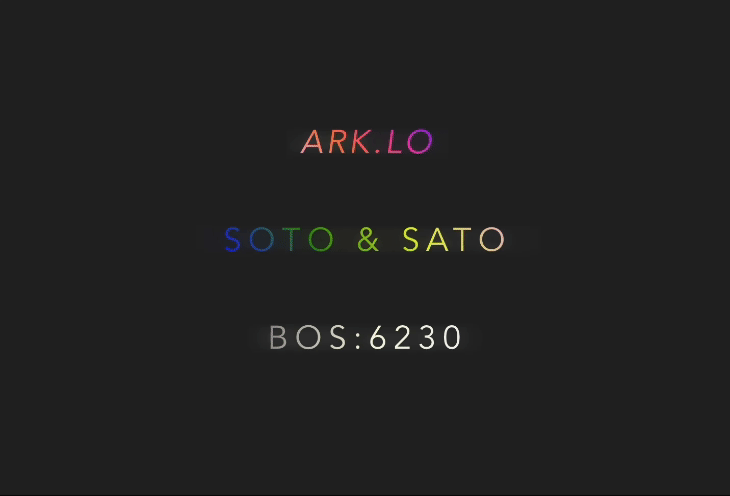

# **_HTML Text FX_**

An HTML custom element for text with an animated gradient and light Gaussian blur.

## **_Usage_**

<!-- prettier-ignore -->
```html
<text-gradient
  angle="230"
  stops="#7319fa, #ff33b4, #ff7e29, pink"
>
  Lorem ipsum
</text-gradient>
```

## **_Interface_**

- **name**[string]: Optional component name to avoid CSS custom property collisions
- **angle**[number]: Angle of the gradient in degrees
- **stops**[string]: Comma seperated list of gradient colour stops
- **x**[number]: X axis blur standard deviation
- **y**[number]: Y axis blur standard deviation
- **intensity**[number]: Blur intensity (TODO)
- **speed**[number]: Speed of the animation (TODO)
- **debug**[boolean]: Log additional debugging info

## **_Looks like_**


